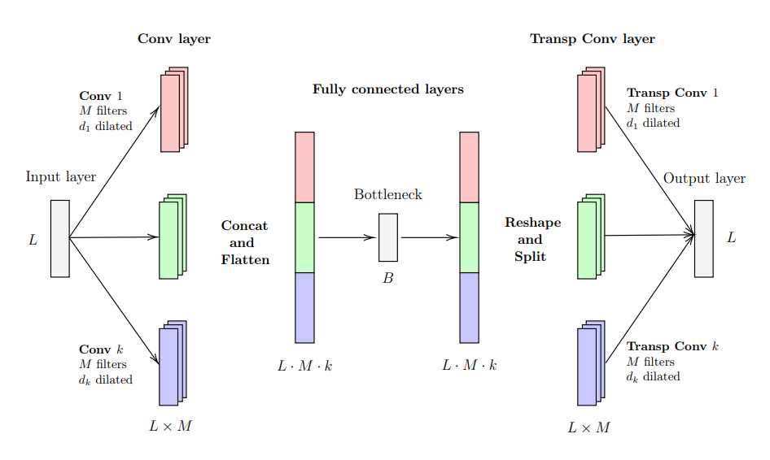

# Autoencoder

Implementation of a Dilated Convolutional Autoencoder for univariate Time Series.

<br>
<div align="center">
	
</div>
<br>

## Requirements

Python 3.8 required. Some packages are incompatible with version 3.9. See [here](https://github.com/ray-project/ray/issues/11287).

Install dependencies using pip,

```
pip install -r requirements.txt
```

## Getting Started

Structure of the project,

```
.
├── data     
│   └── ElectricDevices
├── src
│   ├── configs
│   │   ├── arma.yaml
│   │   ├── arma2357.yaml
│   │   └── config.yaml
│   ├── dataloader.py
│   ├── experiments
│   │   ├── exp1-shapley_value.ipynb
│   │   ├── exp2-acc_cor.py
│   │   └── exp3-plane_representation.py
│   ├── interpretability.py
│   ├── main.ipynb
│   ├── models
│   │   ├── CAE.py
│   │   └── losses.py
│   ├── train.py
│   ├── tuning.py
│   └── utils.py
├── utils
└── weights
```

Execute the jupyter notebook `main.ipynb` to load the data, train the model and obtain the evaluation and interpretation.

## Pretrained Models

In `weights` there are the pretrained models with the optimal hyperparameter settings.

The models are:

- ARMA with dilation 2, 3, 5, or 7 in separate datasets. Each dilation is trained separately in `armaX.pth` with **X** the corresponding dilation.
- ARMA with dilation 2, 3, 5, or 7 in the same dataset. The pretrained model is `arma2357.pth`.
- Electric Devices dataset. The pretrained model is `mod.pth`.

The configuration files are placed in `src/configs`. Use `arma.yaml` for the first case, `arma2357.yaml` for the second and `config.yaml` for Electric Devices.
In the first case, there was no hyperparameter tuning and we use standard values for the hyperparameters.

By default `main.ipynb` uses the Electric Devices dataset.
